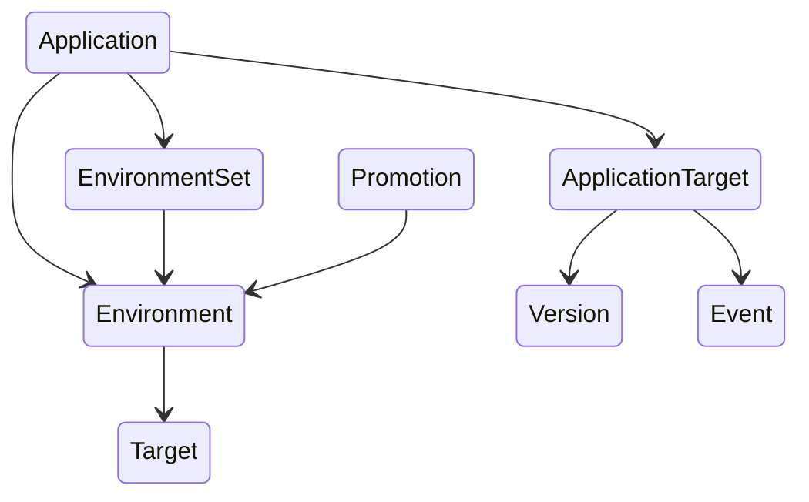

# depot

Depot is a version management system for environments.

## Problem Statement

Nowadays, organizations use a plethora of different systems for
deploying different things. Kubernetes for microservices, maybe Lambdas
for ML models, ECS for developer tools, etc. With each of these
disparate systems, there's no common way of handling environments or
what version goes where. Flux requires GitOps, ArgoCD mutable tags, push
for ECS, etc. What's even worse, these very systems break down further
when you try to add a new environment, resulting in config file updates
or bespoke automation to support a new addition.

Depot aim to solve this problem by centralizing the storage of
environments and their subsequent versions.

## Use-Cases

* Standardizing version management across environments for
  microservices, ML models, and more.
* Auditing deployment events across environments
* No config new environment addition (e.g., add a new k8s cluster)

## Design

### Constraints

* Be able to group environments in such a way that environments can
  "include" them. This reduces environment duplication and
  configuration.
* Environments are a group of destinations where an application runs.
  While we can have 1:1 Environment to "cluster" (or, Target), we should
  assume most things have `n` targets. As such, top-level environments
  should be where versions are updated.
* Support promoting between environments on a set schedule. Eventually
  we will want to support hooks/conditions for said promotions.

### Primitives

Depot is built on the following basic primitives:

* `Application`: Represents anything that needs a version to be tracked
  (e.g., microservice, ML model version)
* `Environment`: A unit where an application should have a separate
  version
* `Target`: A location under an environment (e.g., k8s cluster)
* `Version`: A version of an application, set on an environment
* `Event`: An event describing when a version was changed and what
  changed it. Useful for auditing or other tracking purposes.

From there, a few other high-level constructs exist to reduce some
common problems encountered when deploying things:

* `EnvironmentSet` - A group of environments that an `Application` can
  inherit from. When combined with Environments, names that match will
  be merged together.
* `Promotion` - Behaviour for promoting a version from one environment
  to another.



### Applications

Applications tie together all of the other primitives into a trackable
unit of environments, their targets and their subsequent versions. An
example structure is provided below.

```go
type Application struct {
  Name string
  Description string
  URL string

  // EnvironmentSets and Environments can be mixed. These groups turn
  // into the eligible 'targets' that versions and events are stored
  // under.
  EnvironmentSets []EnvironmentSet
  Environments []Environment

  // Targets is an application-specific mapping of Targets that are
  // apart of this application. This is where the underlying version
  // state is stored.
  Targets map[string]ApplicationTarget
}

type ApplicationTarget struct {
  Version Version
  Events []Event
}

type Version struct {
  // Desired is the version that is currently desired to be deployed.
  Desired string

  // Deployed is the current version that has been deployed.
  Deployed string
}
```

### Environments

Users will have multiple choices for managing environments. Either by
working with `EnvironmentSets` or `Environment`s directly. An example
structure is provided below.

```go
type Environment struct {
  Name string
  Targets []Target
}
```

An `EnvironmentSet` is simply a list of `Environment`s that, when tied
to an application, is used as the list of `Environment`s for that
application. An example structure is provided below.

```go
type EnvironmentSet struct {
  // Name is the name of the environment set. This is used as a display
  // name.
  Name string

  // Environments is a list of environments that are apart of this set.
  Environments []Environment
}
```

This enables updating the targets and environments list of all
applications that are using it seamlessly. During the initial design
phase of `depot`, it will not support additional environments on top,
but eventually support may be added to facilitate layering of sets.

### Promotions

Promotions between environments are handled by a `Promotion` object
which specifies behaviour for promoting between environment a to
environment b. An example structure is provided below.

```go
type Promotion struct {
  Source Environment
  Target Environment
  Interval time.Duration // cron
}
```

By default, the `Interval` field is a simple promote after X time field
where Source's `Version` will be promoted (replace) to Target's
`Version`.

**Note**: If a Promotion object is not created, an environment must be
manually promoted.

## Planned Infrastructure

* PostgreSQL - For storing data listed above.
  * Promotion intervals will also be stored in Postgres. They will be
    loaded in memory and executed by a single instance of the service.
    Eventually, we can bring in other infrastructure/smarter systems to
    handle failure modes but the scale of these crons doesn't warrant it
    right now.
* Kubernetes - Container orchestration (Helm package provided).
  * A general-purpose Docker image will also be provided.

## API

depot will provide a gRPC API for consumers to use. The following
RPCs will be implemented.

### API: Applications

* `GetApp(appID) Application`
* `CreateApp(Application) Application`
* `UpdateApp(appID, Application)`

* `GetVersion(appID, targetID) Version`
* `SetVersion(appID, environmentID, Version)`
* `SetDeployedVersion(appID, targetID, Version)`
* `Promote(appID, environment)`

### API: Environments

* `GetEnvironments() []Environments`
* `GetEnvironment(environmentID) Environment`
* `CreateEnvironment(Environment) Environment`
* `UpdateEnvironment(Environment)`

* `GetEnvironmentSets() []EnvironmentSets`
* `GetEnvironmentSet(environmentSetID) EnvironmentSets`
* `CreateEnvironmentSet([]Environments) EnvironmentSet`
* `DeleteEnvironmentSet([]Environments)`

### API: Targets

* `CreateTarget(environmentID, Target) Target`
* `DeleteTarget(environmentID, targetID)`

## Integrations

depot will contain a few first class integrations for syncing versions
for relevant environments to their destinations.

### ArgoCD

Due to the nature of plugins being limited to rendering manifests and
version tracking limited to _just_ Helm and Git, our integration pushes
state into ArgoCD.

A small component will be ran inside of same cluster where ArgoCD is
being ran. This component will be ran with the following information:

* Target ID

From there, this component will periodically poll depot for updated
versions of applications. Whenever an application is updated that is
configured to deploy to said target, the component will update the
related ArgoCD application. By default, it is equal to the name of the
depot application.

It is assumed that another process in your ArgoCD system will ensure
that the ArgoCD applications are created (e.g., app of apps, or another
system of discovering/distributing your ArgoCD manifests). This may
entail ignoring changes to the `version` spec.

### Flux

Flux has a [notification controller]. This controller can update
GitRepository revisions. depot will provide an integration for calling
webhooks which will enable this integration.'

If, for some reason, we're unable to provide a notification controller,
we will need to provide an integration similar to the image repository
reconciliation system. However, documentation on Flux's side is vague. If
that is also not supported, we will instead have to build automation to
hook into Flux's repo automation, which will have to push directly to
the source Git repository (thanks GitOps).

[notification controller]: https://fluxcd.io/flux/guides/webhook-receivers/
